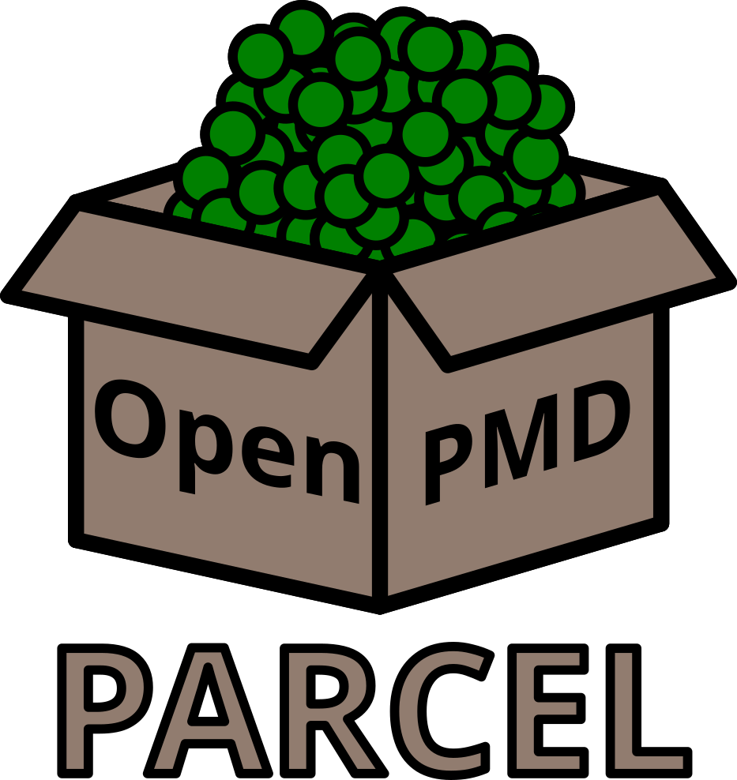

----

Read and write particle-tracking code and particle-in-cell code data in the [OpenPMD standard](https://github.com/openPMD/openPMD-standard).

Parcel is a single header C implementation of the OpenPMD standard with the BeamPhysics extension using [HDF5](https://www.hdfgroup.org/solutions/hdf5/) as its backend.
It is designed for simple integration with existing physics simulation codes.
Drop the single file `parcel.h` into your codebase and call it to allow your tool to interchange particle data with the many other codes that use the OpenPMD format.


## Dependencies

Parcel is C99 compliant and its only dependency is HDF5.

## Usage

This project uses the same convention as the [stb libraries](https://github.com/nothings/stb).
Simply copy the header file `parcel.h` into your project and include in everything that requires its interface.
Then, in one and only one of your `.c` files, use the following line to include the library's implementations.
```c
#define PARCEL_IMPLEMENTATION
#include "../parcel.h"
```

## Compiling and Running Tests

The tests in this project are built using CMake and have additional dependencies beyond HDF5 in order to generate test files.
Follow these steps to build the tests and then run them.
1) Install required dependencies through conda environment and activate. This will download and install HDF5 and the required python dependencies.
```
conda env create -f environment.yml
conda activate parcel-dev
```
2) Use CMake to build the tests.
```
mkdir build
cd build
cmake ..
make
```
3) Run the tests. This should run all C tests and check generated test files with the [OpenPMD Validator](https://github.com/openPMD/openPMD-validator).
```
# From inside of build/
ctest
```
4) [Optional] If any errors occur, running the individual test binaries may reveal more information.
```
./tests/test_read
./tests/test_write
./tests/test_read_write
./tests/test_utilitis
./tests/test_generate_openpmd
```

### Optional CMake Arguments
The following options may be used in the CMake command to enable additional debug features.
 - `-DDEBUG=ON`: Enable debug flags (ie for use with valgrind).
 - `-DCLANG_TIDY=ON`: Run `clang-tidy` during builds and error out on issues.

## Implementation Notes

### File Handle Management

When implementing internal functions that need to access iteration files, always use `pmd_open_iteration()` instead of directly calling `H5Fopen()`. This ensures that:

- Multiple file handles to the same HDF5 file are never opened simultaneously (which could cause corruption)
- File handles are properly reused when an iteration is already open
- All file access goes through the proper tracking mechanisms

Example:
```c
// DON'T do this:
hid_t file_id = H5Fopen(path, H5F_ACC_RDWR, H5P_DEFAULT);
// ... use file_id ...
H5Fclose(file_id);

// DO this instead:
pmd_iteration *iter;
pmd_open_iteration(series, index, &iter);
// ... use iter->file_id ...
pmd_close_iteration(iter);
```

## Name

**Par**cel: a package containing **par**ticle data.

## License
This code was written by Christopher M. Pierce and is released under the BSD 3-Clause License.
